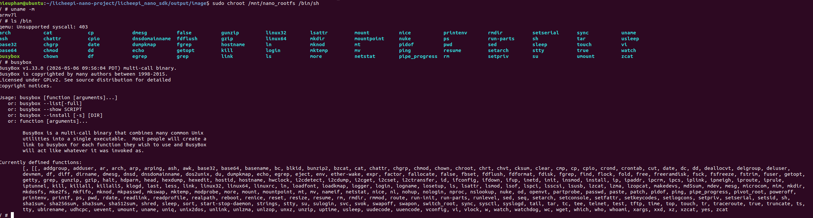

# Bài Tập Thực Chiến Embedded Linux - LicheePi Nano

## 1. Giới Thiệu
Dự án hướng dẫn tự tay xây dựng (build) một bản phân phối Linux hoàn chỉnh từ mã nguồn gốc cho board mạch nhúng LicheePi Nano sử dụng vi xử lý Allwinner F1C100s (kiến trúc ARM926EJ-S), hỗ trợ khởi động hệ điều hành từ thẻ nhớ TF Card.

## 2. Lý Do Chọn Buildroot
Board LicheePi Nano sử dụng chip Allwinner F1C100s với đặc điểm đặc thù là bộ nhớ RAM DDR1 dung lượng cực kỳ giới hạn (chỉ 32MB) được tích hợp (siết chung) ngay bên trong chip. Với dung lượng RAM siêu nhỏ này, hệ thống không thể gánh được các bản phân phối Linux thông thường hoặc các bộ nhân Kernel cồng kềnh.

**Buildroot** là giải pháp tối ưu nhất nhờ cơ chế tự động tải, cấu hình và dịch chéo (Cross-compile) để tạo ra một hệ thống Embedded Linux siêu tối giản, kiểm soát chặt chẽ dung lượng sao cho vừa vặn với cấu trúc phần cứng 32MB RAM.

## 3. Boot Flow System (Quy Trình Khởi Động)
Quá trình khởi động của LicheePi Nano diễn ra theo một chuỗi tuần tự nghiêm ngặt qua các tầng kiến trúc:

1. **BROM (Boot ROM):** Đoạn mã được nạp sẵn (hardcode) vào vi mạch. Khi cấp nguồn, BROM chạy đầu tiên và quét thẻ nhớ TF Card tại vị trí sector 16 (offset 8KB) để tìm kiếm chữ ký hợp lệ của Bootloader.
2. **SPL (Secondary Program Loader):** Do SRAM nội bộ của chip cực kỳ nhỏ (chỉ 32KB), không đủ để chứa U-Boot. BROM sẽ nạp SPL vào SRAM trước. Nhiệm vụ của SPL là cấu hình xung nhịp (Clock) và khởi tạo bộ nhớ chính DRAM 32MB.
3. **U-Boot (Proper):** Sau khi DRAM sẵn sàng, U-Boot bản đầy đủ được SPL nạp lên RAM. Nó cung cấp giao diện dòng lệnh UART, đọc kịch bản boot.scr, sau đó nạp lõi nhân hệ điều hành (zImage) và sơ đồ phần cứng (.dtb) vào các địa chỉ cố định trên RAM rồi gọi lệnh bootz.
4. **Linux Kernel:** Kernel tự giải nén, thiết lập Bộ quản lý bộ nhớ ảo (MMU), tiếp nhận thông tin phần cứng qua file .dtb để khởi tạo driver (UART, SD/MMC, USB...), và Mount phân vùng RootFS.
5. **RootFS (BusyBox):** Cuối cùng, Kernel gắn kết (Mount) hệ thống tệp tin gốc và gọi tiến trình đầu tiên `/sbin/init` để người dùng bắt đầu tương tác qua Terminal.

## 4. Tùy Biến Cấu Hình Phần Cứng (Hardware Customization)

Trong dự án này, sơ đồ mô tả phần cứng (Device Tree) đã được tinh chỉnh và đóng gói thủ công trong thư mục `custom_hardware/` để đảm bảo tính tương thích giữa nhân Linux 5.2 và board mạch LicheePi Nano:

* **`suniv-f1c100s.dtsi`**: Tệp mô tả cấu trúc gốc của chip SoC (System on Chip). File này định nghĩa các tài nguyên phần cứng cấp thấp như bộ quản lý xung nhịp (CCU), các cổng ngắt (Interrupt Controller), và các bus ngoại vi (UART, SPI, I2C).
* **`suniv-f1c100s-licheepi-nano.dts`**: Tệp mô tả chi tiết các kết nối cụ thể trên board mạch Nano, bao gồm việc kích hoạt UART0 làm Console, cấu hình tần số cho thẻ nhớ SD và thiết lập bộ nhớ RAM tích hợp 32MB.

Việc tách riêng các file này giúp hệ thống biên dịch luôn sử dụng đúng cấu trúc phần cứng đã được kiểm chứng, tránh các lỗi xung nhịp (clock-bindings) thường gặp khi sử dụng mã nguồn Device Tree không đồng bộ.

## 5. Các Bước Tiến Hành Build
Hệ thống được biên dịch chéo trên môi trường Host Ubuntu (X86_64) sang kiến trúc ARM mục tiêu:

### Bước 5.1: Chuẩn bị môi trường Host
bash
sudo apt update
sudo apt install -y build-essential libncurses5-dev rsync cpio unzip bc g++ bison flex texinfo locales git

### Bước 5.2: Biên dịch hệ thống
Sử dụng bộ SDK tối ưu cho dòng LicheePi, chạy kịch bản đóng gói tự động cho thẻ nhớ:

Bash
./build.sh nano_tf

## 6. Nhật Ký Debug Và Xử Lý Sự Cố 
Trong quá trình triển khai, hệ thống đã gặp và xử lý các lỗi nghiêm trọng sau:

### Sự cố: Thiếu quy tắc dịch Device Tree (.dtb)
Nguyên nhân: Kịch bản build.sh mặc định gọi make mrproper làm mất file cấu hình .config khiến Makefile mất dấu mục tiêu biên dịch cho dòng chip Suniv.

Xử lý: Can thiệp trực tiếp vào thư mục nhân Lichee-Pi-linux, chỉnh sửa arch/arm/boot/dts/Makefile để đăng ký cứng mục tiêu: dtb-y += suniv-f1c100s-licheepi-nano.dtb.

## 7. Kết Quả (Deliverables)
### 7.1. File ảnh hệ điều hành (OS Disk Image)
File thành phẩm: nano_tf_buildroot_os.img (đã được đổi tên).

Vị trí nộp bài: Do dung lượng lớn, file ảnh được đính kèm tại mục Releases v1.0.0 của Repository này.

### 7.2. Cấu trúc phân vùng thẻ nhớ (TF Card Layout)
Offset 8KB: Chứa u-boot-sunxi-with-spl.bin.

Phân vùng 1 (FAT): Chứa zImage, suniv-f1c100s-licheepi-nano.dtb và boot.scr.

Phân vùng 2 (EXT4): Chứa hệ thống tệp tin gốc RootFS (BusyBox).

## 8. Kiểm Thử Giả Lập (Emulation Testing)

Sử dụng kỹ thuật **Chroot** kết hợp với trình giả lập **QEMU User-mode** để chạy thử nghiệm RootFS ngay trên môi trường Host (x86_64).

### Giải thích chi tiết kết quả:

Dựa trên hình ảnh thực tế quá trình kiểm thử, hệ thống đã xác nhận được các thông số kỹ thuật cốt lõi:

* **Xác minh kiến trúc (Architecture Verification):** Lệnh `uname -m` trả về giá trị **`armv7l`**. Đây là bằng chứng quan trọng nhất cho thấy trình giả lập `qemu-arm-static` đã ánh xạ thành công các lời gọi hệ thống (syscalls) từ kiến trúc ARM của LicheePi Nano sang kiến trúc x86 của máy tính Host. Điều này khẳng định bộ Toolchain biên dịch chéo đã hoạt động chính xác.

* **Kiểm tra tính toàn vẹn của RootFS:**
    Lệnh `busybox` thực thi thành công và hiển thị phiên bản **v1.33.0**. Danh sách các tập lệnh hệ thống (như `ls`, `cp`, `mkdir`, `sh`...) hiện ra đầy đủ, chứng tỏ quá trình đóng gói hệ thống tệp tin gốc bằng Buildroot không xảy ra lỗi phân đoạn (segmentation fault) và các thư viện C (`uClibc` hoặc `musl`) đã được liên kết đúng cách.

* **Môi trường giả lập (Environment):**
    Việc truy cập được vào Shell (`/bin/sh`) thông qua lệnh `chroot` cho thấy cấu trúc phân vùng EXT4 và thứ tự các thư mục tiêu chuẩn Linux (`/bin`, `/sbin`, `/etc`, `/usr`) đã được thiết lập đúng theo tiêu chuẩn phân phối nhúng.

**Kết luận:** Bản build hệ điều hành đã sẵn sàng để nạp vào thẻ nhớ (TF Card) và khởi động trực tiếp trên phần cứng LicheePi Nano.
